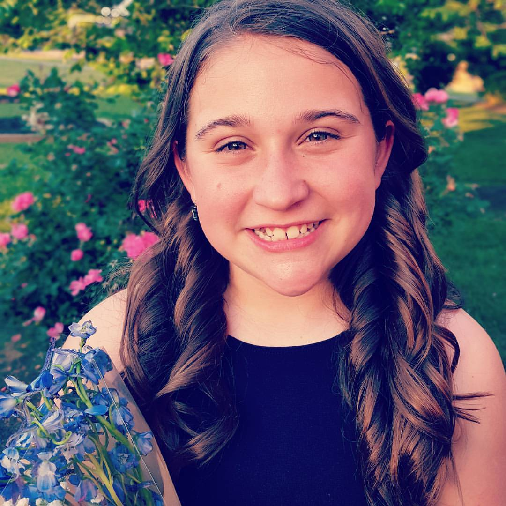
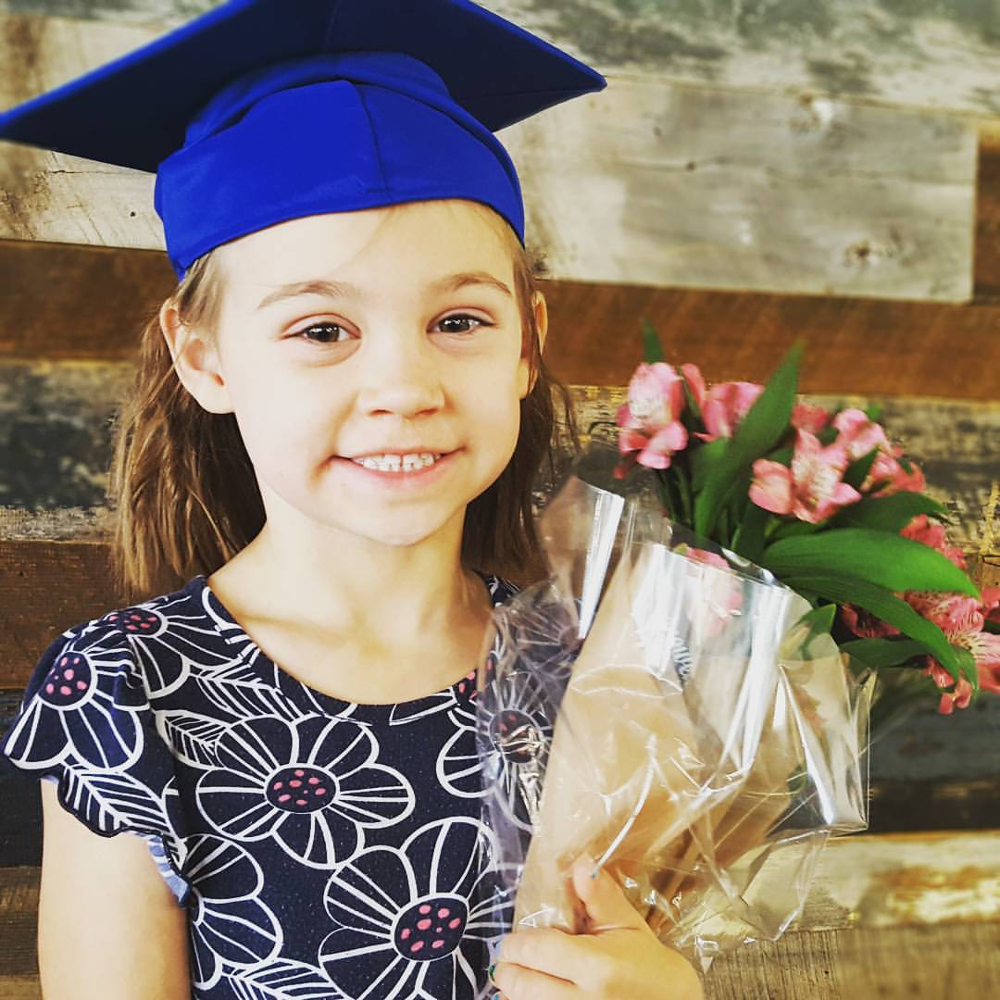
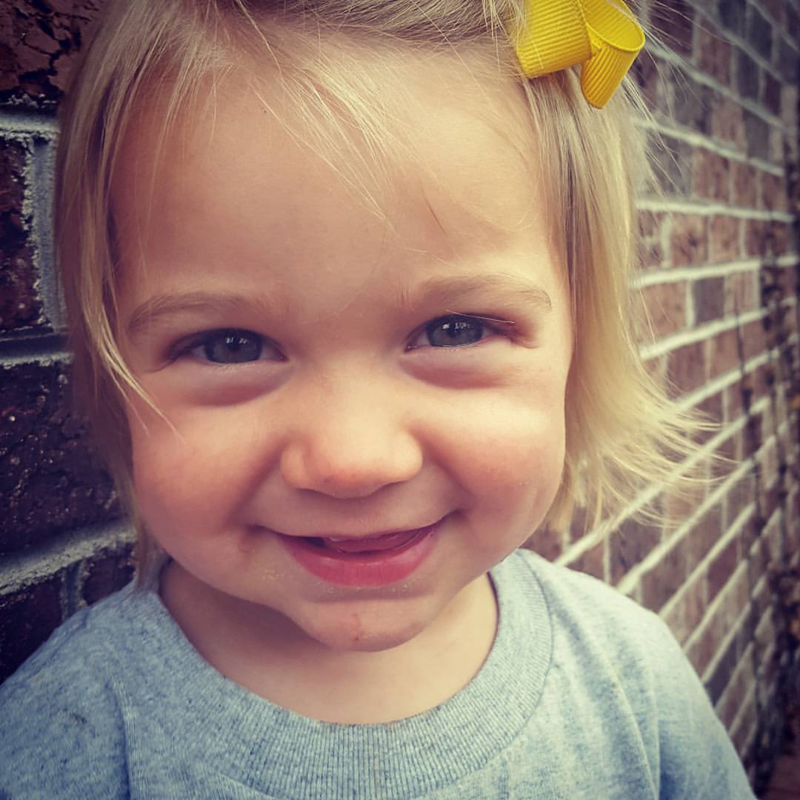

Use Jekyll and GitHub Pages to write a blog post in your username.github.io repository. Topic suggestions:

What I learned my first week at camp
Why I joined a web developer bootcamp
Explanation of a technical topic (eg Centering an image with CSS, merging a Pull Request with GitHub, using Jekyll to split a page into partials)

Hey everyone!

Just wanted to give an update after 4/5 of my first week of class! I've really been looking forward to getting started with this and it hasn't disappointed yet. Along with learning to code the most interesting and helpful parts of the course introduction has been the "other" stuff we've been able to take in as well.

I want to focus on the first two days. We learned about the core values of Awesome in: Be Good, Be Excellent, Be a Friend, and Be You. To complement that Luke Murray, one of the founders of Awesome Inc., came in to speak to expound a little on that. 

What resounded with me the most from those two "talks" was the thought of establishing your why to get your through the 12 weeks of the intense work we will be putting in at Awesome Inc. BootcampS17. My 'why' was easily definable but in the end, and at the start of everyday, I will be reminded of it. It's on my computer. It's going to drive me. 

My why is my girls. They are why I'm doing what I'm doing. It's why I'm going to succeed at this. And why I'll put everything I've got into it. 

Here's a picture of them for you! Hope you enjoy!

 
 
 

Thanks.

Josh

